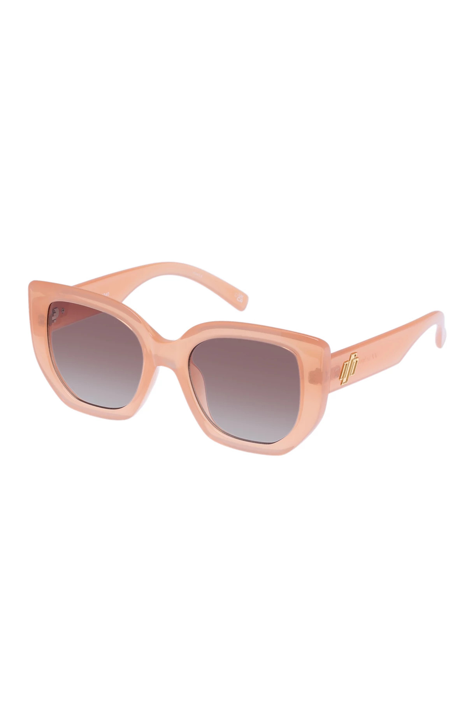

# Swim Sugar
### This is my first capstone project assignment for an ecommerce website.
This project contains 7 pages:<br>
1. index.html<br>
2. onepiece.html<br>
3. registration.html<br>
4. login.html<br>
5. bikinis.html<br>
6. swim.html<br>
7. checkout.html<br>

## Technology Used
The technologies used in this project include:
  * HTML
  * CSS
  *Bootstrap 5

## Install This Project

git clone https://github.com/candicemilburn/capstone1.git

## Some of my favorite HTML:
``` <div class="card" id="sunglasses">
                
                <h4>Gold Suntan Shades</h4>
                <p class="price">$16.99</p>
                <p><button class="btn btn-light" type="submit" data-bs-toggle="modal" data-bs-target="#exampleModal">Add to Cart</button></p>
            </div>
```

This is a card code. This boxes up items of importance. This piece of HTML was the most simple to write but made a very big impact of the look of my product shopping page. There was no CSS used with this particular code but it was still simple and clean and organized 


## This how my website looks


